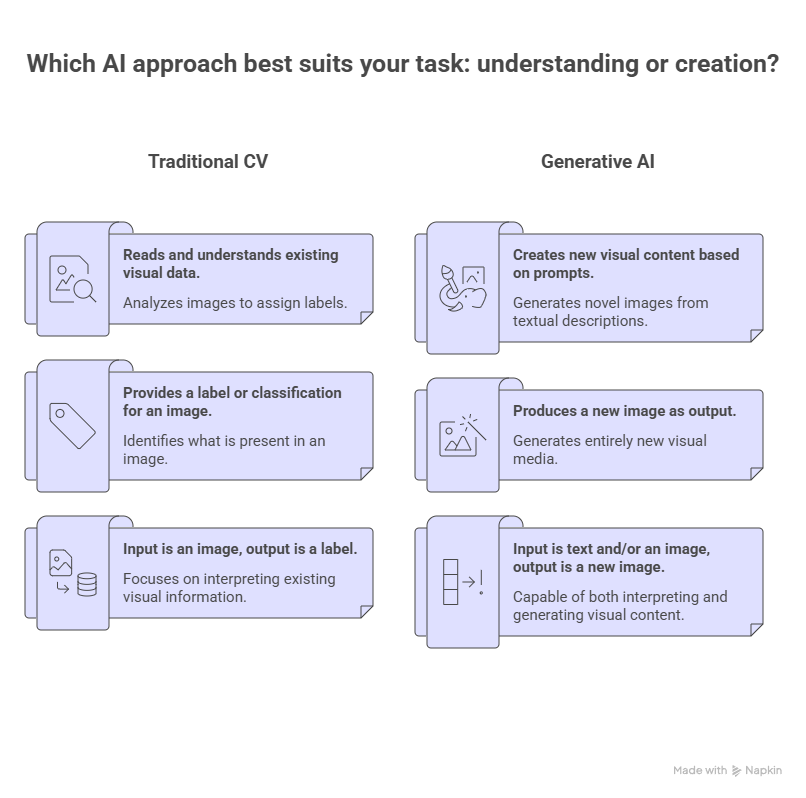
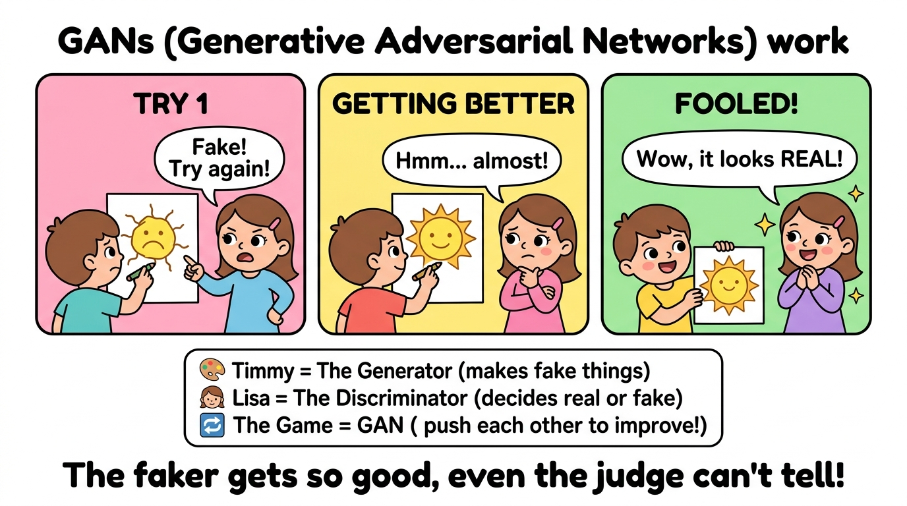
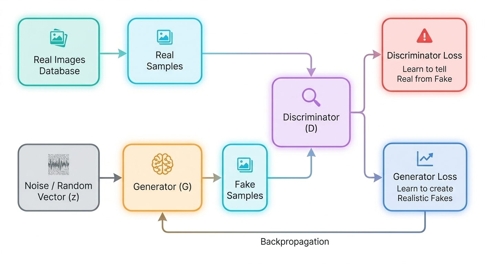
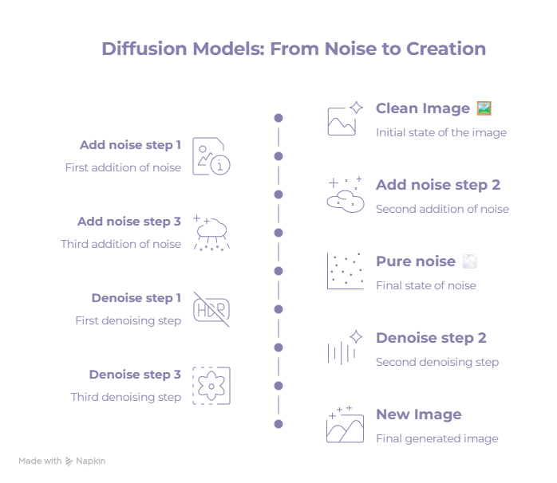
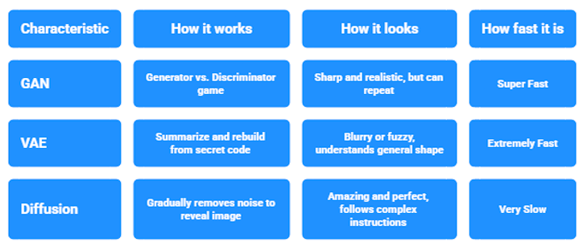

# Generative-AI-in-Computer-Vision-ELI5-Guide
  
## What is Generative AI in Computer Vision?
Computer Vision (CV) is the field of AI that teaches machines to see and understand images. Traditional CV can look at a photo and say "that's a cat" but it can't create anything new.
Generative AI in CV goes one step further: it can create brand new images from scratch.
 
Think of it like a magic genie. You describe what you want "a red cat sitting on a blue chair" and the genie draws it for you. But instead of magic, the AI has studied millions of images during training. It learned what cats look like, what chairs look like, how colors and shapes work together. Then when you ask for something, it mixes everything it learned to generate a completely new image that never existed before.
  
## Why Use Generative AI?
Here's the honest answer: creating visual content is slow, expensive, and requires skills most people don't have. Generative AI changes that.
Some real-world examples:
- Medicine  Doctors can generate synthetic X-ray or MRI scans to train AI models, without needing real patient data (privacy-safe!)
- Gaming Studios auto-generate landscapes, characters, and textures instead of drawing them manually
- Fashion Designers visualize outfits on virtual models before producing a single piece of fabric
- Data augmentation  When you don't have enough training images, GenAI creates more so your AI model learns better
- Image Enhancement  When photos are blurry or low quality, GenAI sharpens and improves them so your AI model sees clearer, more useful data
- Noise Removal  When images have grain or distortion, GenAI cleans them up so the details hidden underneath become visible again
- Filling the Gaps (Inpainting) — When part of an image is missing or damaged, GenAI fills in the blank areas with realistic content that matches the rest of the image
 
In short, Generative AI:
- Saves time and money
- Makes creativity accessible to everyone, not just designers
- Solves real data scarcity problems in AI development
 
But it's not perfect. Results can look unrealistic, it needs clear and precise instructions, and it can sometimes generate images with weird artifacts (extra fingers, distorted faces). It's a powerful tool — not a magic wand.
 
## The Three Main Architectures
 
### GAN
 
#### What is GAN?
Generative adversarial networks (GANs) are an exciting recent innovation in machine learning. GANs are generative models: they create new data instances that resemble training data.
 
#### How GANs Work?
Imagine a little boy named Timmy who wants to trick his sister Lisa by drawing a fake sun that looks totally real.
At first, Timmy is bad at it. He draws a wobbly ugly sun, and Lisa immediately says "Fake! Try again!" — she's not fooled at all.
So Timmy watches real suns, practices, and tries again. This time Lisa hesitates… "Hmm… almost!" He's getting closer!
After enough practice, Timmy draws a sun SO good that Lisa gasps and says "Wow, it looks REAL!" — she's completely fooled. Timmy won!
That's exactly how a GAN works inside a computer:
- Timmy = The Generator → it creates fake images from scratch and keeps trying to make them look real
- Lisa = The Discriminator → it looks at images and tries to catch which ones are fake
- The Game = GAN → they compete against each other, and because of that competition, both get better and better
 
The Generator keeps fooling the Discriminator. The Discriminator keeps getting harder to fool. Until one day… the fake looks completely real.
  
#### GAN Structure
A generative adversarial network (GAN) has two parts:
- The generator learns to generate plausible data. The generated instances become negative training examples for the discriminator.
- The discriminator learns to distinguish the generator's fake data from real data. The discriminator penalizes the generator for producing implausible results.
 
When training begins, the generator produces obviously fake data, and the discriminator quickly learns to tell that it's fake.
  
#### Training the Discriminator and Generator
 
**During discriminator training:**
1. The discriminator classifies both real data and fake data from the generator.
2. The discriminator loss penalizes the discriminator for misclassifying a real instance as fake or a fake instance as real.
3. The discriminator updates its weights through backpropagation from the discriminator loss through the discriminator network.
 
**During generator training:**
1. Sample random noise.
2. Produce generator output from sampled random noise.
3. Get discriminator "Real" or "Fake" classification for generator output.
4. Calculate loss from discriminator classification.
5. Backpropagate through both the discriminator and generator to obtain gradients.
6. Use gradients to change only the generator weights.
 
---
 
### Variational Autoencoders (VAE)
 
#### What is a VAE?
Imagine you have a box of colored pencils. Each pencil represents an idea or an image. VAEs are like artists who use these pencils to create new images from what they have already seen.
  
#### The Three Blocks of the Architecture
 
**Step 1: Learning to Draw**
- Looking at images: First, the artist (the VAE) looks at many images. For example, it can see photos of cats, dogs, and landscapes.
- Understanding shapes: Then, it tries to understand what makes each image unique. It notes the colors, shapes, and patterns.
 
**Step 2: Creating a Drawing**
- Reducing the image: The artist takes all this information and reduces it to a small box of pencils. This means it simplifies the image to keep only the most important things.
- Drawing again: With this simplified box, the artist can now start drawing new images. For example, it can mix the colors and shapes it has learned to create a new cat that does not exist yet.
 
**Step 3: Improving the Drawing**
- Looking at the result: After drawing, the artist looks at its work. Does it look like a real cat?
- Learning from mistakes: If it is not perfect, it learns from its mistakes. Maybe it used too much blue or the ears are not pointy enough.
- Repeating the process: It keeps drawing, looking, and improving until it is happy with its work.
 
#### Why use a VAE?
VAEs are useful because they can create new and unique images from what they have learned. This can be used in many fields such as art, fashion, and video games.
 
#### Real-World Examples
Once a VAE is trained, it can do many useful things:
- **Image Generation**: The VAE invents a random sticky note and draws a brand new image ,like a face of a person who does not exist in real life.
- **Interpolation**: You take the sticky note of a cat and the sticky note of a dog, and you slowly mix them together. You get images that look like something between a cat and a dog — a smooth transition step by step.
- **Image Denoising**: You give the VAE a damaged or blurry photo. It reads the sticky note (the key features) and draws it back cleanly — like restoring an old photograph.
- **Anomaly Detection**: If an image creates a very strange sticky note that looks nothing like normal notes, the VAE knows something is wrong. This is used in factories to detect broken products, or in hospitals to spot unusual medical scans.
- **Medical Imaging**: Real medical data is hard to get. The VAE can create fake-but-realistic MRI scans to help train other AI models — more data, better results.
 
#### Advantages & Limits
 
**What VAEs do well:**
- **Easy to train**: VAEs are much more stable than other AI models like GANs. They learn smoothly without crashing or going in the wrong direction.
- **Organized internal space**: The sticky note system is clean and structured. You can change one number and see exactly how the image changes — like a volume knob for each feature.
- **Finds problems automatically**: Because VAEs know what "normal" looks like, they can spot abnormal images without being taught what abnormal is.
- **One model, many uses**: The same model can reconstruct, generate, denoise, and detect anomalies. Very versatile.
 
**Where VAEs struggle:**
- **Images can look a bit blurry**: Because the VAE tries to be "average" and safe, the images it creates are sometimes not as sharp and detailed as real photos.
- **GANs make prettier pictures**: If you only care about visual quality, GANs produce crisper results — but they are much harder to train.
- **Hard to choose the right size**: The sticky note cannot be too short (loses details) or too long (does not learn to summarize). Finding the right size takes experimentation.
 
---
 
### Diffusion Models
Imagine you take a beautiful drawing and you keep sprinkling sand on it, little by little, until the drawing completely disappears into a pile of sand. Now imagine teaching an AI to reverse that process — starting from a pile of random sand, it learns to remove the noise step by step until a clean, beautiful image appears.
  
The magic is in the training — the AI practices reversing noise millions of times until it becomes really good at it. Then when you give it a text prompt, it starts from pure random noise and "denoises" its way to your image.
 
#### Real-World Examples
- **DALL·E, Midjourney, Stable Diffusion** type "a astronaut riding a horse on Mars" and get a photorealistic image in seconds
- **Medical imaging** generate realistic synthetic MRI or CT scans for training diagnostic AI
- **Fashion & product design** visualize a product prototype from a text description before building it
- **Video generation** tools like Sora use diffusion-based ideas to generate entire video clips from a prompt
 
---
 
## Key Differences: GAN vs VAE vs Diffusion
  
| Architecture | Main Idea | Advantages | Limits |
|---|---|---|---|
| **GAN** | Two networks compete: Generator creates fakes, Discriminator tries to catch them | Sharp images, fast generation, great for style transfer | Unstable training, easy to collapse, needs careful balancing |
| **VAE** | Compress an image into a "sticky note", then reconstruct or generate from it | Stable training, controllable features, good for denoising and anomaly detection | Blurry outputs, less sharp than GANs, tricky to size the latent space |
| **Diffusion Models** | Learn to reverse a step-by-step noise process to build images from scratch | Best image quality, excellent text-to-image control, supports inpainting | Slow generation, high compute cost, more complex to train |
 
##  Architecture Comparison
 
| | **GAN** | **VAE** | **Diffusion Models** |
|---|---|---|---|
| **Core Idea** | Two networks compete: one creates, one judges | Compress image to a "sticky note", then redraw it | Learn to reverse a noise-adding process step by step |
| **Image Quality** | Sharp and realistic | Smooth but sometimes blurry | Best quality of all three |
| **Speed** | Fast once trained | Fast | Slow — many steps needed |
| **Training Stability** | Unstable — hard to balance | Very stable | Stable but heavy |
| **Controllability** | Moderate | Good — structured latent space | Excellent with text prompts |
| **Best For** | Style transfer, face generation | Anomaly detection, denoising, data generation | Text-to-image, inpainting, video |
| **Famous Examples** | StyleGAN, DeepFake | Medical imaging tools | DALL·E, Midjourney, Stable Diffusion |
| **Main Weakness** | Training can collapse | Blurry outputs | Slow and compute-heavy |
